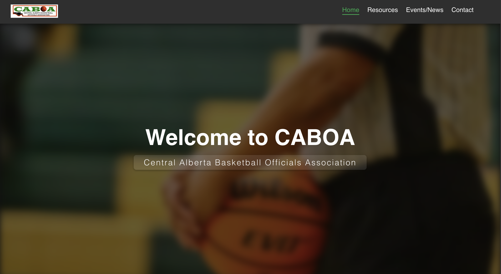

# CABOA Website

The official website for the **Central Alberta Basketball Officials Association (CABOA)**, built using **React**. It showcases upcoming events, association resources, news, and executive team information for basketball officials in Central Alberta.

## 🚀 Live Demo

👉 [Visit the Live Site](https://khymnad.github.io/CABOA/)

---

## 📸 Preview



---

## 🛠️ Tech Stack

- **React** (with functional components and Hooks)
- **React Router DOM** (v6+ for SPA routing)
- **Framer Motion** (for scroll-triggered and UI animations)
- **CSS Modules** (component-scoped styles)
- **GitHub Pages** (for deployment)

---


---

## 💡 Features

- ✅ Smooth SPA routing with React Router
- ✅ Scroll-to-top on navigation change
- ✅ Auto-scrolling event carousel (with pause on hover)
- ✅ Dynamic team and news sections using data arrays
- ✅ Responsive layout and interactive design
- ✅ Deploys to GitHub Pages with ease

---

## 🧪 Getting Started Locally

```bash
# Clone the repository
git clone https://github.com/KhymNad/CABOA.git
cd CABOA

# Install dependencies
npm install

# Start development server
npm start

